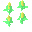

farmsim
=======

A HTML5 2-D Gardening Simulator Game project

Try it now!
https://msakuta.github.io/farmsim/farmsim.html

Features
--------

This project focuses on the accuracy of reproducing experience in
gardening with home-grown vegetables (based on my personal experience).
It does not try to simulate large scale farms.
In particular, your Working Force is very limited, so you need to plan accordingly to succeed with high quality products.

The quality of crops affects the selling price, so you want to keep the quality
high for sustainable gardening business.
The crops will degrade over time, so if you spend too much time to grow them,
they may have no profit in the market.
You need to grow crops fully before harvesting and selling them.

Crops
-----

### Potatoes

Potatoes are basic product which many home gardeners try first.
They have high yield and easy to grow, but you have to watch out for Potato Pests
which reduces quality of crops in a sequential planting (monoculture).

### Corns

Corns are very popular, easy to grow crops.
They can grow with low humidity and robust against pests.
The drawback is that they require high amount of fertility in the soil, which means you may need to fertilize the soil for successful gardening.
They are also sold in a lower price than potatoes.

Prerequisites
-------------

This game uses pure JavaScript, no additional plugins are required on your side.
You need a decent browser though.

The game state is saved into your browser, which is entirely in the client side.
If you want to continue playing with a different device, you'll need to serialize the game state
and copy it to another device.

Libraries
---------

This project uses i18next JavaScript library.
